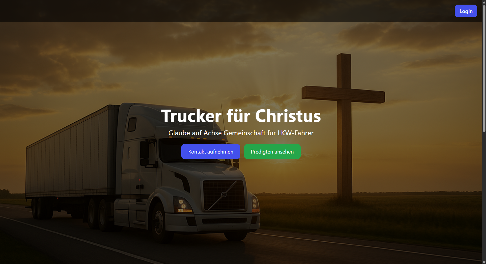
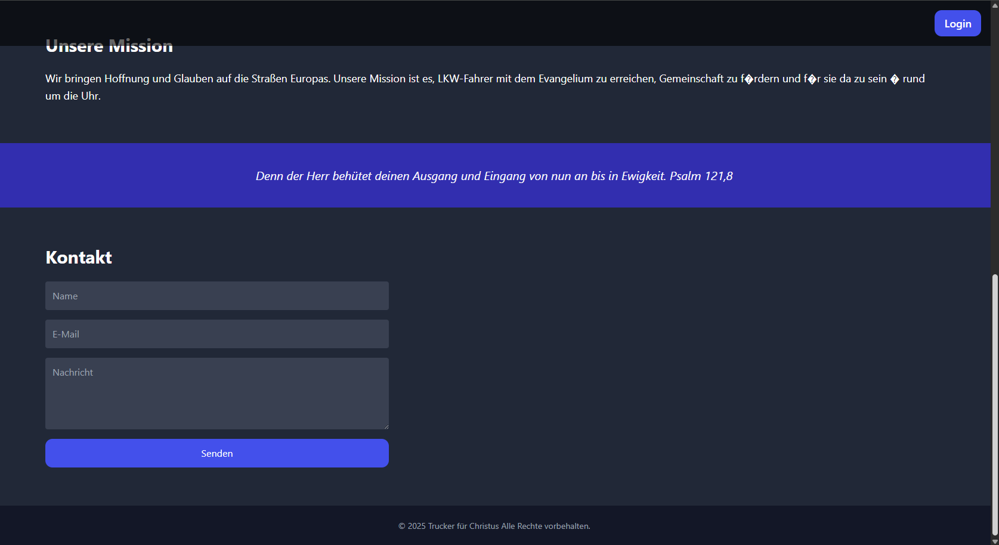
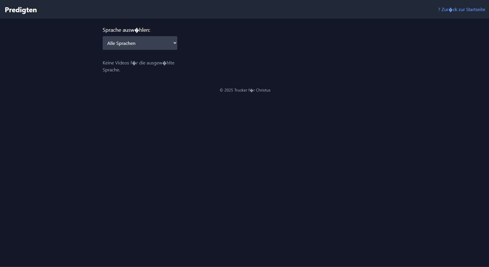
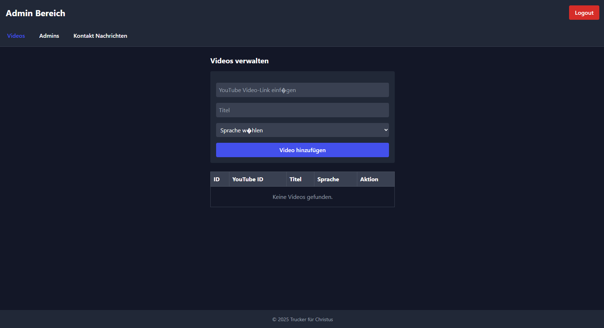
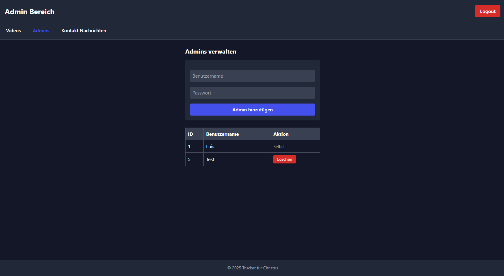
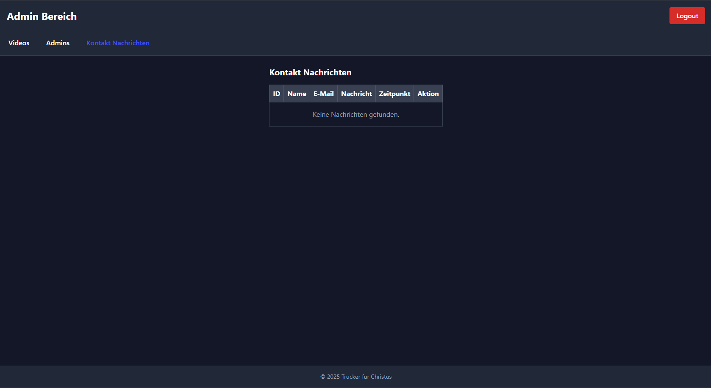

# Trucker für Christus

**Eine Missions- und Gemeinschafts-Website für LKW-Fahrer in Europa**

---

## Projektbeschreibung

Diese Website wurde für eine christliche Missionsgesellschaft entwickelt, die speziell LKW-Fahrer auf den Straßen Europas mit dem Evangelium erreichen möchte. Ziel ist es, Hoffnung und Glaube zu vermitteln, Gemeinschaft zu fördern und Unterstützung rund um die Uhr anzubieten.

## Funktionen

- **Startseite mit Mission Statement**  
- **Kontaktformular** für Anfragen und Gebetsanliegen  
- **Predigten und Videos** in verschiedenen Sprachen  
- **Adminbereich** zum Verwalten von Videos, Nachrichten und Administratoren  
- **Login-/Logout-Funktion** für Administratoren

## Verwendete Technologien

- **Frontend:** HTML, CSS, JavaScript
- **Backend:** PHP
- **Datenbank:** MySQL (Zugangsdaten sind nicht im Quellcode enthalten!)

## Hinweise

- **Sensible Daten:**  
  Zugangsdaten und Passwörter wurden im Code durch Platzhalter ersetzt.
- **Demo:**  
  Die Website ist online erreichbar unter: [trucker-missions.de](https://trucker-missions.de)
- **Status:**
  Die Website ist in der Entwicklung.

  ## Vorschau

**Startseite**

**Login-Seite**

**Kontaktformular**

**Videos-Seite**

**Adminbereich – Übersicht**

**Adminbereich – Videos verwalten**

**Adminbereich – Kontakt Daten**

